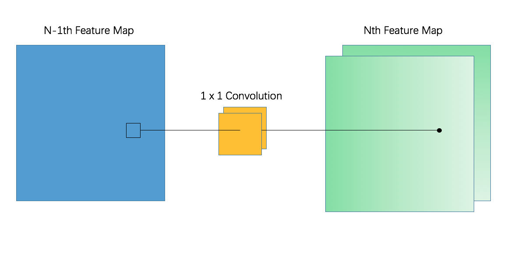

# YOLOv3 Compression 

### Weight Pruning

​	When getting the object, what we first want to do is to look at the distinct feature of YOLO and propose a method maybe only satisfying this certain structure. Finally we found that YOLO is only having 1 x 1 and 3 x 3 kernels. For those 1 x 1 kernels, we can view it as a vector instead of a tensor. Considering a single layer shown in following image. If two 1 x 1 kernels are really "similar", then the same input feature map can get a very "similar" feature map out. These two "similar" feature maps are really useless since the features they extract are almost the same. Then we can conclude we can prune one of these two "similar" 1 x 1 filters since the little difference of the two feature map.
​	Then the question becomes how to measure the similarity between two 1 x 1 vectors. As we mentioned above, they can be seen as a vector. For vectors, we can use Euclidean distance \& Cosine similarity to denote how they distinguish with each other. We add a weight to Euclidean distance and cosine similarity to get a balanced result. Actually for 3 x 3 vectors, matrix norm can do the same job but in vectors this is much simpler than in tensor. Then we can get the following formula to compute the similarity between two 1 x 1 filters:
​          							$$ w_1ED(k_1, k_2) + w_2CS(k_1, k_2) $$ 		
where $w_1, w_2$ denotes the weight distributed to the two standard function, $ED$ denotes euclidean distance, $CS$ denotes cosine similarity and $k_1, k_2$ denotes the two 1 x 1 filters. Getting the formula, we can measure the similarity and prune the most similar filters in order to wash out those "same" filters.



​	We have tried finetune but the result is not satisfying.

### Weight Clustering

​	We implemented the clustering by training YOLOv3 on a very small dataset and get the weights after training. Then we implemented k-means for weights of each layer of the model so as to minimize the WCSS:
 								$$\mathop{\arg\min}_C\sum_{i=1}^{k}\sum_{w\in c_i}|w-c_i|^2$$

We cluster the weights into 32 groups.

### Final Result

Before Clustering on Kangaroo

| Pruning Method                    | mAP   | Prune Ratio |
| --------------------------------- | ----- | ----------- |
| No Pruning                        | 98.91 | 0 / 6147W   |
| Weight Pruning                    | 94.48 | 1844W       |
| Similarity Pruning                | 98.24 | 1673W       |
| Similarity Pruning(Big Threshold) | 95.89 | 1957W       |

After Clustering on Kangaroo

| Pruning Method                    | mAP   | Prune Ratio |
| --------------------------------- | ----- | ----------- |
| No Pruning                        | 98.80 | 0 / 6147W   |
| Weight Pruning                    | 93.15 | 1844W       |
| Similarity Pruning                | 98.24 | 1673W       |
| Similarity Pruning(Big Threshold) | 95.88 | 1957W       |

Clustering Result

| Whether Clustering | mAP   | Inference time |
| ------------------ | ----- | -------------- |
| No Clustering      | 98.79 | 19.99s         |
| Clustering         | 99.04 | 18.93s         |

No Clustering on RBC

| Pruning Method     | mAP  | Prune Ratio   |
| ------------------ | ---- | ------------- |
| No Pruning         | 82.6 | 0 / 6147W     |
| Weight Pruning     | 75   | 1844W / 6147W |
| Similarity Pruning | 77.8 | 1957W / 6147W |

### Usage

To evaluate the model without pruning

```
python evaluate.py -c config.json -p 1
```

To evaluate the model with weight pruning

```
python evaluate.py -c config.json -p 2
```

To evaluate the model with similarity pruning

```
python evaluate.py -c config.json -p 3
```

To try to do finetune, just run finetune.py and clustering.py for clustering.
### Thanks

Keras-YOLOv3 origin code: [YOLOv3](https://github.com/experiencor/keras-yolo3)
